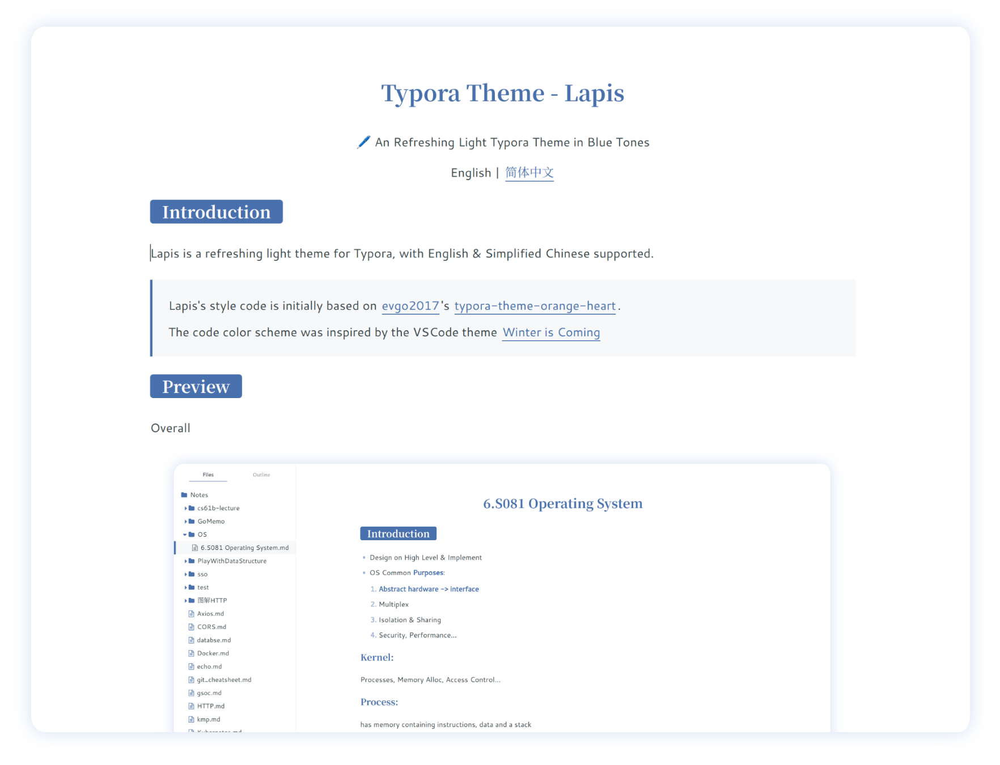
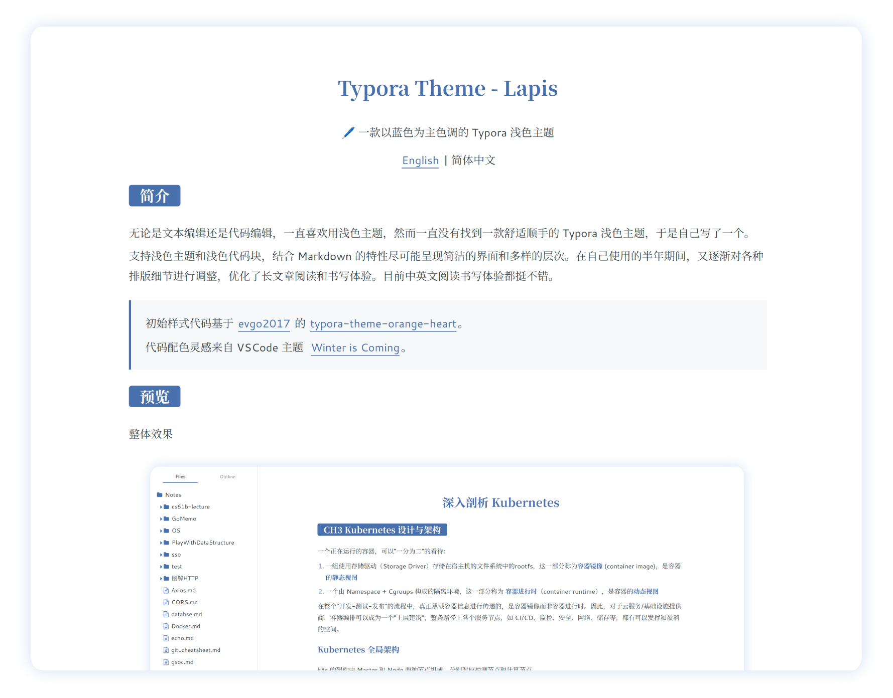
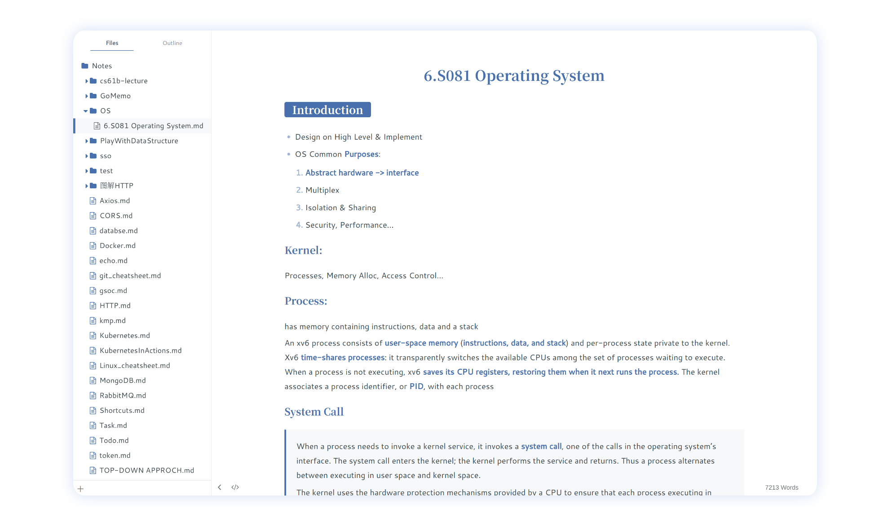
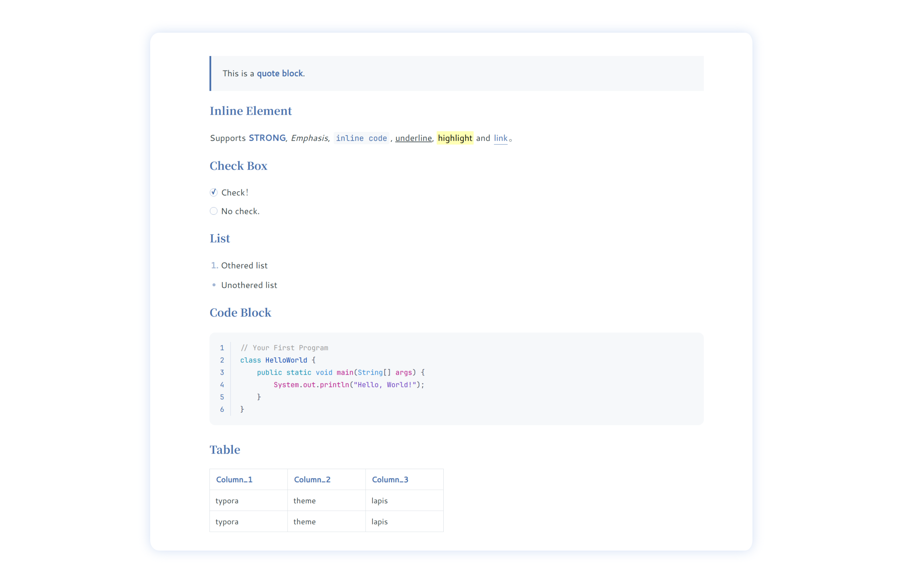

<h1 align="center">Typora Theme - Lapis</h1>

🖊️ An Refreshing Light Typora Theme in Blue Tones

English / <a href="https://github.com/YiNNx/typora-theme-lapis/blob/master/README-CN.md">简体中文</a>

## Introduction

Lapis is a refreshing light theme for Typora, with English & Simplified Chinese supported.

> Lapis's style code is initially based on [evgo2017](https://github.com/evgo2017)'s [typora-theme-orange-heart](https://github.com/evgo2017/typora-theme-orange-heart).
>
> The code color scheme was inspired by the VSCode theme [Winter is Coming](https://vscodethemes.com/e/johnpapa.winteriscoming/winter-is-coming-light-no-italics)

## Preview

Overall

Styles Supported

## Features

- Supports English & 简体中文 with fonts [Cantarell](https://fonts.google.com/specimen/Cantarell) and [Source Han Serif](https://source.typekit.com/source-han-serif/cn/).
- Combines Markdown features to present a clean interface and a comfortable visual hierarchy.
- Provides a light code color scheme inspired by VSCode's [Winter is Coming](https://vscodethemes.com/e/johnpapa.winteriscoming/winter-is-coming-light-no-italics), with the font [Jetbrains Mono](https://www.jetbrains.com/lp/mono/).

## Installation

1. Clone this repository or download [the ZIP file](https://cdn.just-plain.fun/static/lapis_latest.zip).
2. In Typora, open "Preferences" (`File` > `Preferences`). And then switch to the "Appearance" tab and click the "Open Theme Folder" button.
3. Copy the `lapis.css` file and the `lapis` folder into Typora's theme folder.
4. Restart Typora and select the `Lapis` theme from the theme menu.

## Contributing

As developed on a Linux platform, this theme may have some unexpected issues on other platforms.

If you have any issues or suggestions, please submit [GitHub Issues](https://github.com/YiNNx/typora-theme-lapis/issues). Thank you for your feedback and contributions!

## License

The Lapis Typora theme is released under the MIT License. You are free to use, modify, and distribute this theme.

---

Enjoy Markdown with Lapis! 📘